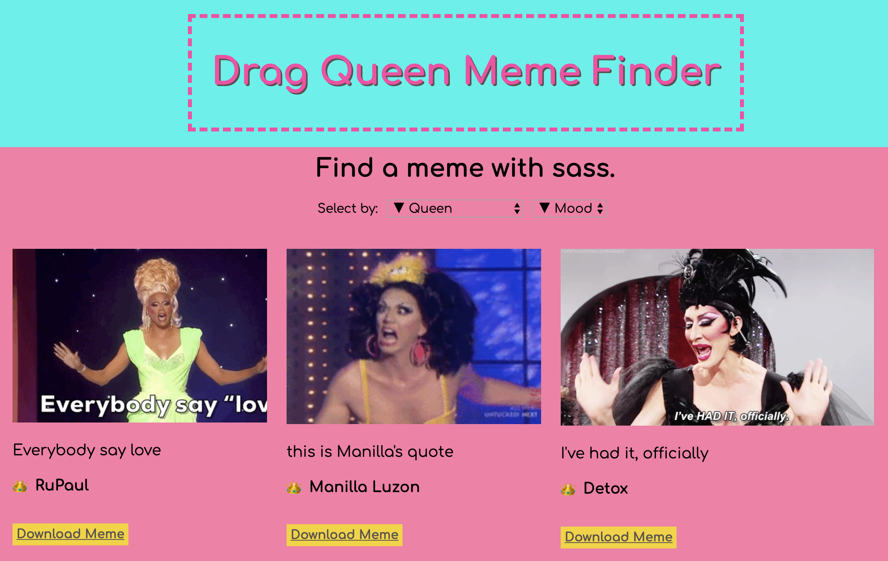

# Drag Queen Meme Finder App

_This was made during my time as a student at [Code Chrysalis](https://www.codechrysalis.io/)._

---

## What is this?

This is a fullstack app, that displays a postgres database of Drag Queen gifs and quotes. You can filter by queen or mood, and download the gifs to share. [Check out the Demo](https://cc11-drag-queen-stage.herokuapp.com/)

---

## API Endpoints

This is a simple REST API with only a get endpoint that returns all items in the table. Please use `/api`.

---

---

## from react app:

This project was bootstrapped with [Create React App](https://github.com/facebook/create-react-app).

## Available Scripts

In the project directory, you can run:

#### `yarn start`

Runs the app in the development mode. 
Open [http://localhost:3000](http://localhost:3000) to view it in the browser.

The page will reload if you make edits. 
You will also see any lint errors in the console.
